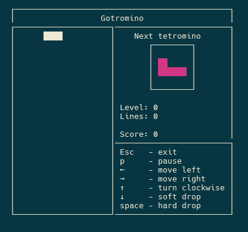

Gotromino - a console Tetris™-like game written in go
===========================================

### Motivation
I don't remember writing a Tetris™ game during my programming career,
which is pretty weird. So here it goes.
Tetris™, golang, terminal UI. What could be better?

### Installation
Install this go package with `go get -u github.com/nikarh/gotromino`

### Game
